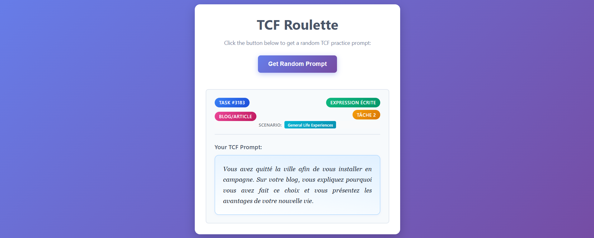

# 🎯 TCF Roulette - Practice Tracker

[](https://golang.org/)
[](https://www.sqlite.org/)
[](https://reussir-tcfcanada.com/)
[](https://www.boot.dev)

> A web application for randomized TCF (Test de Connaissance du Français) practice prompts. Built for Boot.dev Hackathon 2025.



## 📖 About

TCF Roulette is a simple yet elegant web application that helps French language learners practice for the TCF exam by providing random prompts from a curated database. Built with Go, SQLite, and vanilla JavaScript, this project foray into backend development with Go.

## ✨ Current Features

- 🎲 **Random Prompt Generation** - Get randomized TCF practice prompts
- 🏷️ **Rich Task Metadata** - View task ID, category, type, format, and scenario
- 📱 **Clean, Responsive UI** - Modern gradient design built to work seamlessly on desktop and mobile
- 🗄️ **SQLite Database** - Lightweight local database for prompt storage
- 🔄 **Real-time Loading** - Smooth user experience with loading states

## 🛠️ Tech Stack

- **Backend:** Go 1.24+ with `net/http`
- **Database:** SQLite with `modernc.org/sqlite` (pure Go driver)
- **Frontend:** Vanilla HTML, CSS, JavaScript
- **Styling:** CSS3 with gradients and modern design patterns

## 🚀 Quick Start

### Prerequisites
- [Go 1.21+](https://golang.org/dl/) installed
- SQLite database file with TCF prompts (`data\tcf.db`)

### Installation & Running

```bash
# Clone the repository
git clone https://github.com/fwSara95h/tcf-practice-tracker.git
cd tcf-practice-tracker

# Clean up dependencies (first time)
go mod tidy

# Start development server
go run main.go # you might need to click "Allow" on the warning that pops up before it runs

# Visit in browser
# Windows: start http://localhost:8080
# macOS: open http://localhost:8080
# Linux: xdg-open http://localhost:8080
```

## 📂 Project Structure

```
tcf-practice-tracker/
├── main.go              # Go server with HTTP handlers & SQLite
├── go.mod               # Go module dependencies
├── templates/
│   └── index.html       # Main HTML page
├── static/
│   ├── main.js          # Frontend JavaScript
│   └── style.css        # CSS styling
└── data/
    └── tcf.db           # SQLite database (your data)
```

## 🚀 Deployment Options

### 1. Local Production Build

**Windows:**
```powershell
# Build executable
go build -o tcf-tracker.exe

# Run production server
.\tcf-tracker.exe
```

**macOS/Linux:**
```bash
# Build executable
go build -o tcf-tracker

# Run production server
./tcf-tracker
```

### 2. Cloud Deployment

#### **Heroku**
```bash
# Create Procfile
echo "web: ./tcf-tracker" > Procfile

# Deploy
git push heroku main
```

#### **Railway**
```bash
# Just push to Git - Railway auto-detects Go
git push origin main
```

#### **DigitalOcean App Platform**
1. Upload your code to GitHub
2. Connect DigitalOcean to your repository
3. Select Go as runtime
4. Deploy automatically

#### **VPS/Traditional Server**
```bash
# Build for Linux (if developing on Windows/Mac)
GOOS=linux GOARCH=amd64 go build -o tcf-tracker

# Upload tcf-tracker + templates/ + static/ + data/ to server
# Run with systemd or similar service manager
```

### 3. Docker Deployment
```dockerfile
FROM golang:1.24-alpine AS builder
WORKDIR /app
COPY . .
RUN go build -o tcf-tracker

FROM alpine:latest
RUN apk --no-cache add ca-certificates
WORKDIR /root/
COPY --from=builder /app/tcf-tracker .
COPY --from=builder /app/templates ./templates
COPY --from=builder /app/static ./static
COPY --from=builder /app/data ./data
CMD ["./tcf-tracker"]
```

## 🔮 What's Next

### 🎯 Coming Soon (v0.2-0.3)
- [ ] **🔄 Completion Tracker** - Mark prompts as completed to prevent repetition
- [ ] **🎛️ Smart Filtering** - Choose specific categories, formats, and task types  
- [ ] **📊 Progress Dashboard** - Visual statistics and completion tracking
- [ ] **⏱️ Session Management** - Timer and study session summaries
- [ ] **🌐 GitHub Pages Version** - Frontend-only deployment for easy sharing

### 📋 Full Roadmap
**See our comprehensive [Feature Roadmap](./auxil/ROADMAP.md)** for detailed plans including:
- 🔐 User accounts and personalization
- 🎨 Dark mode and custom themes
- 📚 Interactive study guides and resources
- 🎧 Audio prompts and speaking practice
- 🤖 AI-powered feedback and smart content
- 📱 Mobile apps and browser extensions
- *...and much more!*

## 🤝 Contributing

This is my first Go project, so I'm always open to feedback and suggestions! Feel free to:

- 🐛 Report bugs
- 💡 Suggest features
- 🔧 Submit pull requests
- 📖 Improve documentation

## 📝 License

MIT License - feel free to use this project for learning or your own TCF practice needs!

## 🙏 Acknowledgments

- **[Boot.dev](https://www.boot.dev)** for their free Python and Go tutorials, and for organizing the hackathon that motivated me to finally commit time to this project
- **[Réussir TCF](https://reussir-tcfcanada.com/)** for providing free access to sample exam tasks, updated regularly with current TCF standards
- **F. Hazrati**, an excellent French teacher who always strives to help her students succeed while keeping learning enjoyable

---

**Happy practicing! Bonne chance avec votre TCF! 🇫🇷✨**
